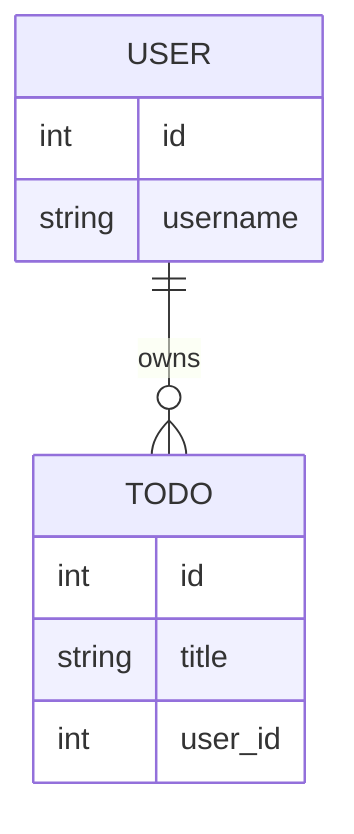

## What is ERD?
- 全名 **Entity Relationship Diagram**
- 表示**資料怎麼存、怎麼連在一起**的一張圖
- 通常會是在建構資料庫前會做的一件事 (先想好資料庫要長什麼樣子)，這樣看很像廢話，但一剛開始是真的會不知從何下手

## 名詞解釋
1. Entity -> 系統中的重要物件如 User、Todo、Document
2. Relationship -> 物件間如何連結 (一個 User 有很多個 Todo，一個 Todo 只屬於一個 User)

## Construct
- 我希望先實作一個簡單的設計

1. 一個 User 對應多個 Todo 清單

2. 一個 Todo 對應單個 User

3. 每個實體都增加一些基本訊息，比如說 id 、 username

